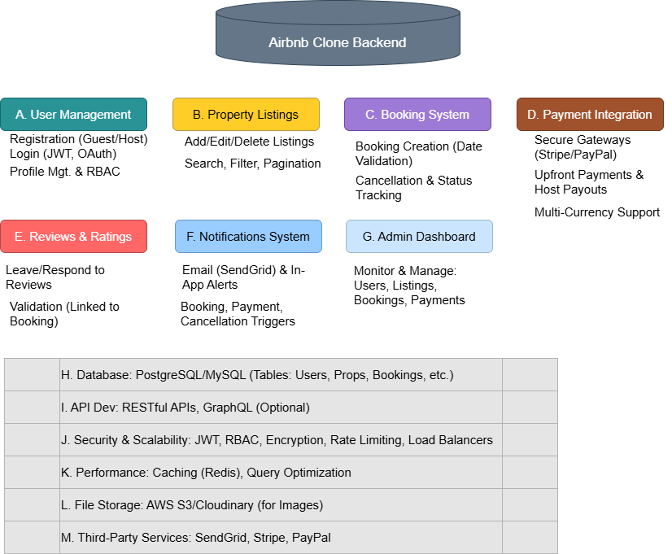

#  Airbnb Clone Backend — Features & Functionalities

This document describes all the backend features and technical capabilities required to build the Airbnb Clone project. It serves as a reference for API development, database structure, and backend implementation planning.

---

## 🖼 Backend Architecture Diagram
The following diagram illustrates the core backend modules and supporting technical components:

---

## 🔑 Core Functional Modules

### A. User Management
- User registration (Guest / Host role)
- Login/logout with JWT authentication
- Password hashing & profile settings
- OAuth login (Google, Facebook) — optional

### B. Property Listings
- Hosts can create, update, delete property listings
- Property details: photos, amenities, pricing, availability, location
- Searchable & visible to all users

### C. Booking System
- Create booking with date validation to prevent double bookings
- Manage booking status: Pending → Confirmed → Completed or Cancelled
- Track reservations linked to Guests & Hosts

### D. Payment Integration
- Guest payment during booking (Stripe, PayPal)
- Host payouts after stay completion
- Multi-currency support & payment tracking

---

## ⭐ Additional Functionalities

### E. Reviews & Ratings
- Guests provide ratings & feedback after completed stays
- Hosts can reply to reviews

### F. Notifications System
- Email and in-app alerts for:
  - Booking confirmation
  - Cancellation
  - Payment updates

### G. Admin Dashboard
- User, booking & property moderation
- Handle complaints & system-level controls

---

## 🛠 Technical Requirements

| Category | Description |
|---------|-------------|
| **H. Database** | PostgreSQL/MySQL with tables: Users, Properties, Bookings, Reviews, Payments |
| **I. API Development** | RESTful APIs (GraphQL optional) |
| **J. Security & Scalability** | JWT, RBAC, encryption, rate limiting, load balancers |
| **K. Performance Optimization** | Redis caching, query optimization |
| **L. File Storage** | Property images & profile photos — AWS S3/Cloudinary (project uses file storage) |
| **M. Third-Party Services** | Stripe, PayPal for payments — SendGrid/Mailgun for email |
